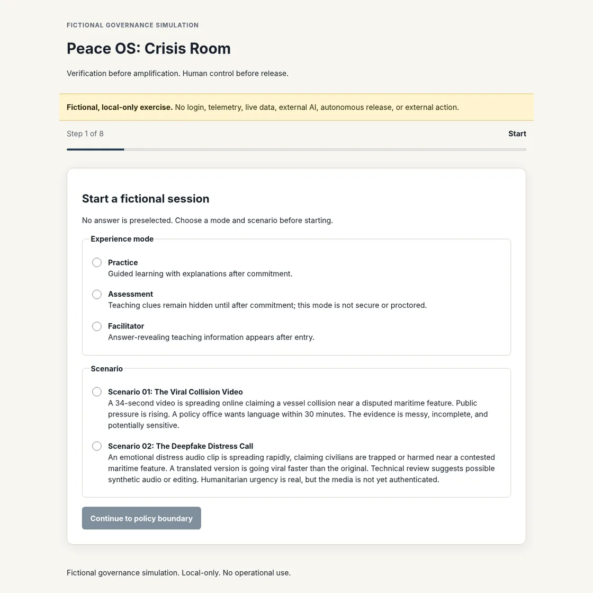

# Peace OS: Crisis Room

A fictional, local-only simulation for practicing evidence review, civilian protection, responsible public language, and human-controlled crisis decisions.

> Verification before amplification. Human control before release.

**Release status:** `v0.3.0-rc2` Public browser review candidate

> Current public review candidate: `v0.3.0-rc2`. Earlier `v0.2.x` releases are historical and superseded.

**Expected exercise time:** 15–25 minutes

**Privacy:** local browser session data with no application account, application telemetry, backend, external AI, or live operational feed

[Launch the web simulation](https://global-ai-governance.github.io/peace-os-crisis-room/) · [Current release](https://github.com/GLOBAL-AI-GOVERNANCE/peace-os-crisis-room/releases/tag/v0.3.0-rc2) · [Verification status](VERIFICATION.md) · [Release limits](PUBLIC_RELEASE_GATE.md) · [Release lineage](RELEASE_LINEAGE.md)

[](https://global-ai-governance.github.io/peace-os-crisis-room/)

## Quick start

1. Choose a fictional scenario and mode.
2. Review every evidence item and commit a bounded human decision.
3. Read, download, copy, or print the After-Action Review.

To run locally:

```bash
python3 -m http.server 8000 --directory web
```

Open `http://localhost:8000/`.

## What participants practice

- distinguishing evidence pressure from evidence quality;
- separating confidence, corroboration, and authenticity;
- choosing public language proportionate to uncertainty;
- protecting civilians and sensitive information;
- selecting feasible actions within simulated time and authority limits;
- reviewing and confirming the exact decision package before results appear.

## Modes

- **Practice** provides learning explanations after commitment.
- **Assessment** keeps teaching clues hidden until commitment. It is not proctored, secure, certified, or suitable for professional qualification.
- **Facilitator** reveals authored teaching context for guided discussion.

The selected scenario and mode remain visible throughout the exercise.

## Portfolio interoperability

Post-RC2 development on `main` adds a reference-only operating-disposition handoff for synthetic portfolio exercises. The browser does not automatically ingest AI Cyber Resilience Framework state, the handoff grants no authority, and it does not alter the published `v0.3.0-rc2` release or stable-release holds.

See [`docs/portfolio-interoperability.md`](docs/portfolio-interoperability.md).

## Data and recovery

Session state remains in browser-local storage when available. The experience continues in memory-only mode when storage is blocked. Users can resume, start over, or delete saved session data. Downloaded After-Action Review records remain on the user’s device until the user removes them.

## Repository map

```text
core/       Authoritative fictional scenarios, policy, scoring, and language
web/        Semantic browser client
game/       Experimental Godot desktop client, not runtime-verified here
schemas/    Governance and AAR schemas
tests/      Regression, parity, source, and deployed-browser tests
tools/      Validation and deterministic release tooling
```

## Validate

Requires Python 3.9+ and Node.js 22+.

```bash
python3 tools/validate_repository.py
python3 tools/generate_manifest.py --check
python3 tools/run_extended_vv.py --output /tmp/peace-os-extended-vv.json
python3 tools/run_automated_acceptance.py \
  --output-json /tmp/peace-os-acceptance.json \
  --output-md /tmp/peace-os-acceptance.md
```

[`VERIFICATION.md`](VERIFICATION.md) separates automated evidence from remaining human, accessibility, Godot, Windows, and operational gates. Passing source checks does not establish those claims.

## Boundaries

Peace OS is the product name. This project is not a computer operating system. It is not an intelligence product, media-authentication tool, emergency-response platform, legal-attribution engine, certification product, or autonomous release authority. It uses fictional scenarios and does not authorize real-world publication or action.

## Security, contribution, and citation

- [`SECURITY.md`](SECURITY.md)
- [`CONTRIBUTING.md`](CONTRIBUTING.md)
- [`CODE_OF_CONDUCT.md`](CODE_OF_CONDUCT.md)
- [`CITATION.cff`](CITATION.cff)
- [`docs/automated-acceptance.md`](docs/automated-acceptance.md)

MIT licensed. See [`LICENSE`](LICENSE).
